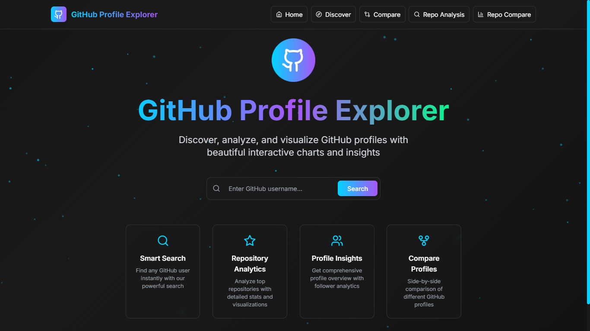

# 🎯 ghRadar (GitHub Profile Explorer)


> **A comprehensive GitHub analytics platform with advanced repository insights, profile exploration, and intelligent comparison tools.**

[](https://reactjs.org/)
[](https://tailwindcss.com/)
[](https://www.framer.com/motion/)
[](https://docs.github.com/en/rest)


  **🚀 Explore • 📊 Analyze • ⚔️ Compare • 🎯 Discover**
  
   • [Report Bug](https://github.com/abbasmir12/ghRadar/issues) • [Request Feature](https://github.com/abbasmir12/ghRadar/issues)
</div>

---

## 🌟 What is ghRadar?

ghRadar is a **next-generation GitHub analytics platform** that transforms how developers explore, analyze, and compare GitHub profiles and repositories. Built with modern web technologies, it provides deep insights through beautiful visualizations, comprehensive analytics, and intelligent comparison tools.

### 🎯 **Core Mission**
Empower developers, recruiters, and tech enthusiasts with **actionable insights** from GitHub data through intuitive visualizations and comprehensive analytics.

---

## ✨ Key Features

### 🔍 **Advanced Profile Analytics**
- **Deep Profile Insights** - Comprehensive user statistics, contribution patterns, and activity analysis
- **Repository Intelligence** - Smart categorization, health scoring, and performance metrics
- **Language Distribution** - Beautiful pie charts with connector lines showing programming language usage
- **Contribution Heatmaps** - Visual representation of coding activity over time
- **AI-Powered Summaries** - Intelligent profile analysis and insights

### ⚔️ **Repository Battle Arena**
- **Side-by-Side Comparison** - Compare any two repositories with detailed metrics
- **Comprehensive Analytics** - Stars, forks, contributors, health scores, and activity levels
- **Visual Comparisons** - Radar charts, bar graphs, and performance metrics
- **Language Breakdown** - Compare technology stacks and programming language usage
- **Winner Determination** - Intelligent scoring system to determine overall repository strength
- **Detailed Metrics Table** - 10+ comparison points with winner indicators

### 📊 **Rich Data Visualizations**
- **Interactive Charts** - Hover effects, animations, and responsive design
- **Multiple Chart Types** - Pie charts, bar graphs, line charts, radar charts, and heatmaps
- **Animated Counters** - Smooth number animations for statistics
- **Progress Indicators** - Radial progress charts for health scores
- **Custom Styling** - Dark theme with neon accents and professional appearance

### 🎨 **Modern User Experience**
- **Futuristic Design** - Dark theme with neon blue, purple, and green accents
- **Smooth Animations** - Powered by Framer Motion for fluid interactions
- **Responsive Layout** - Perfect on desktop, tablet, and mobile devices
- **Loading States** - Beautiful skeleton loaders and progress indicators
- **Error Handling** - Graceful error messages and fallback states

### 🚀 **Performance & Reliability**
- **Smart Caching** - Efficient data management and API optimization
- **Rate Limit Management** - Intelligent handling of GitHub API limits
- **Real-time Status** - API status indicator with usage monitoring
- **Offline Support** - Graceful degradation when connectivity is limited
- **Fast Loading** - Optimized bundle size and lazy loading

---

## 🛠️ Technology Stack

### **Frontend Framework**
- **React 18** - Latest React with concurrent features and hooks
- **JavaScript ES6+** - Modern JavaScript with async/await and modules

### **Styling & Animation**
- **Tailwind CSS 3.3** - Utility-first CSS framework with custom design system
- **Framer Motion 10** - Production-ready motion library for smooth animations
- **Custom CSS** - Hand-crafted animations and effects

### **Data Visualization**
- **Recharts 2.8** - Composable charting library built on React and D3
- **Custom Charts** - Hand-built animated components for specialized visualizations
- **SVG Graphics** - Scalable vector graphics for crisp visuals

### **API & Data Management**
- **Axios** - Promise-based HTTP client with interceptors
- **GitHub REST API v3** - Comprehensive GitHub data access
- **Custom API Layer** - Intelligent data processing and caching

### **Development Tools**
- **Create React App** - Zero-configuration React setup
- **ESLint** - Code quality and consistency
- **PostCSS & Autoprefixer** - CSS processing and browser compatibility

---

## 🚀 Quick Start Guide

### **Prerequisites**
- **Node.js** (v16.0.0 or higher) - [Download here](https://nodejs.org/)
- **npm** or **yarn** - Package manager
- **Git** - Version control system

### **Installation Steps**

1. **Clone the Repository**
   ```bash
   git clone https://github.com/abbasmir12/ghRadar.git
   cd ghRadar
   ```

2. **Install Dependencies**
   ```bash
   npm install
   # or
   yarn install
   ```

3. **Environment Setup**
   ```bash
   # Copy the environment template
   cp .env.example .env
   
   # Edit .env file and add your GitHub token (optional but recommended)
   REACT_APP_GITHUB_TOKEN=your_personal_access_token_here
   ```

4. **Start Development Server**
   ```bash
   npm start
   # or
   yarn start
   ```

5. **Open Your Browser**
   Navigate to `http://localhost:3000` and start exploring!

### **Production Build**
```bash
npm run build
# or
yarn build
```

---

## 🔑 GitHub API Setup (Recommended)

### **Why You Need a Token**
- **Higher Rate Limits**: 5,000 requests/hour vs 60 requests/hour
- **Access Private Data**: View your own private repositories
- **Better Performance**: Faster data loading and fewer rate limit issues

### **Creating Your Token**

1. **Go to GitHub Settings**
   - Visit [GitHub Personal Access Tokens](https://github.com/settings/tokens)
   - Click **"Generate new token"** → **"Generate new token (classic)"**

2. **Configure Token**
   - **Name**: `GitHub Radar App`
   - **Expiration**: Choose your preferred duration
   - **Scopes**: Select `public_repo` and `read:user`

3. **Add to Environment**
   ```bash
   # In your .env file
   REACT_APP_GITHUB_TOKEN=ghp_your_token_here
   ```

4. **Restart the Application**
   ```bash
   npm start
   ```

### **Rate Limits Overview**
| Authentication | Requests/Hour | Best For |
|----------------|---------------|----------|
| No Token | 60 | Light usage, testing |
| Personal Token | 5,000 | Full features, production |

---

## 📖 Usage Guide

### **🔍 Profile Exploration**
1. **Search for Users** - Enter any GitHub username in the search bar
2. **View Analytics** - Explore comprehensive profile statistics and insights
3. **Repository Analysis** - Dive deep into repository performance and metrics
4. **Language Insights** - Understand programming language distribution and expertise

### **⚔️ Repository Comparison**
1. **Navigate to Compare** - Click the "Compare" button in the navigation
2. **Enter Repository URLs** - Input two GitHub repository URLs or `owner/repo` format
3. **Analyze Results** - View detailed side-by-side comparison with multiple metrics
4. **Understand Winners** - See which repository excels in different categories

### **📊 Data Interpretation**
- **Health Score** - Repository maintenance quality and best practices
- **Activity Score** - Recent development activity and engagement
- **Community Score** - Stars, forks, and contributor engagement
- **Overall Winner** - Weighted score considering all factors

---

## 🎨 Design Philosophy

### **Visual Identity**
- **Color Palette**: Neon blue (#00d4ff), purple (#a855f7), and green (#00ff88)
- **Typography**: Inter font family for clean, modern readability
- **Dark Theme**: Professional appearance optimized for developer workflows
- **Neon Accents**: Futuristic aesthetic with glowing effects and gradients

### **User Experience Principles**
- **Intuitive Navigation** - Clear information hierarchy and logical flow
- **Responsive Design** - Seamless experience across all device sizes
- **Performance First** - Fast loading times and smooth interactions
- **Accessibility** - WCAG compliant with keyboard navigation support

### **Animation Strategy**
- **Purposeful Motion** - Animations that enhance understanding and engagement
- **Smooth Transitions** - Framer Motion powered animations with easing curves
- **Loading States** - Skeleton loaders and progress indicators for better perceived performance
- **Micro-interactions** - Hover effects and button animations for tactile feedback

---

## 🏗️ Project Structure

```
ghRadar/
├── public/                 # Static assets and HTML template
├── src/
│   ├── components/         # React components
│   │   ├── AnimatedCharts.js      # Custom chart components
│   │   ├── RepositoryComparison.js # Repository comparison feature
│   │   ├── ProfileCard.js         # User profile display
│   │   ├── SearchBar.js           # Search functionality
│   │   └── ...
│   ├── services/          # API services and data management
│   │   ├── githubApi.js          # GitHub API integration
│   │   ├── repositoryApi.js      # Repository-specific API calls
│   │   └── trendingApi.js        # Trending data services
│   ├── styles/            # CSS and styling files
│   ├── utils/             # Utility functions and helpers
│   ├── App.js             # Main application component
│   └── index.js           # Application entry point
├── .env.example           # Environment variables template
├── tailwind.config.js     # Tailwind CSS configuration
└── package.json           # Dependencies and scripts
```

---

## 🔧 Configuration

### **Tailwind CSS Customization**
```javascript
// tailwind.config.js
module.exports = {
  theme: {
    extend: {
      colors: {
        'neon-blue': '#00d4ff',
        'neon-purple': '#a855f7',
        'neon-green': '#00ff88',
        'dark-bg': '#0a0a0a',
        'dark-card': '#1a1a1a',
      },
      animation: {
        'pulse-slow': 'pulse 3s cubic-bezier(0.4, 0, 0.6, 1) infinite',
        'bounce-slow': 'bounce 2s infinite',
      }
    }
  }
}
```

### **API Configuration**
```javascript
// src/services/githubApi.js
const API_CONFIG = {
  baseURL: 'https://api.github.com',
  timeout: 15000,
  rateLimit: {
    authenticated: 5000,
    unauthenticated: 60
  }
}
```

---

## 🚀 Deployment

### **Vercel (Recommended)**
```bash
# Install Vercel CLI
npm i -g vercel

# Deploy
vercel --prod
```

### **Netlify**
```bash
# Build the project
npm run build

# Deploy the build folder to Netlify
```

### **GitHub Pages**
```bash
# Install gh-pages
npm install --save-dev gh-pages

# Add to package.json scripts
"homepage": "https://yourusername.github.io/ghRadar",
"predeploy": "npm run build",
"deploy": "gh-pages -d build"

# Deploy
npm run deploy
```

---

## 📊 Analytics & Insights

### **Supported Metrics**
- **Profile Analytics**: Followers, following, repositories, contributions
- **Repository Metrics**: Stars, forks, watchers, issues, pull requests
- **Code Analysis**: Language distribution, repository size, commit frequency
- **Community Engagement**: Contributor count, issue resolution, activity patterns
- **Health Scoring**: Documentation, maintenance, community guidelines

### **Visualization Types**
- **Pie Charts** - Language distribution with connector lines
- **Bar Charts** - Repository comparison and performance metrics
- **Radar Charts** - Multi-dimensional repository profiling
- **Line Charts** - Activity trends and historical data
- **Heatmaps** - Contribution patterns and activity visualization
- **Progress Rings** - Health scores and completion metrics

---

## 🔒 Privacy & Security

- **No Data Storage** - All data is fetched in real-time from GitHub's public API
- **Client-Side Only** - No server-side data processing or storage
- **Token Security** - GitHub tokens are stored locally and never transmitted
- **Rate Limiting** - Respectful API usage with built-in rate limit handling
- **Open Source** - Full transparency with publicly available source code

---

## 🙏 Acknowledgments

- **GitHub API** for providing the data
- **Framer Motion** for smooth animations
- **Recharts** for beautiful charts
- **Tailwind CSS** for rapid styling
- **Lucide** for clean icons

---

